# DHIS2 AI Assistant Architecture Explained

This document provides a comprehensive overview of the DHIS2 AI Assistant project architecture through visual diagrams.

## 1. High-Level System Architecture

Overview of the main system components and their interactions.

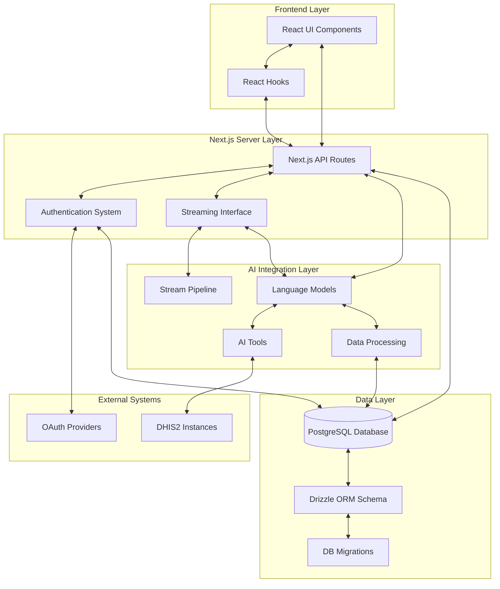

## 2. User Interaction Flow

Sequence diagram showing a user's journey from login to sending a chat message.

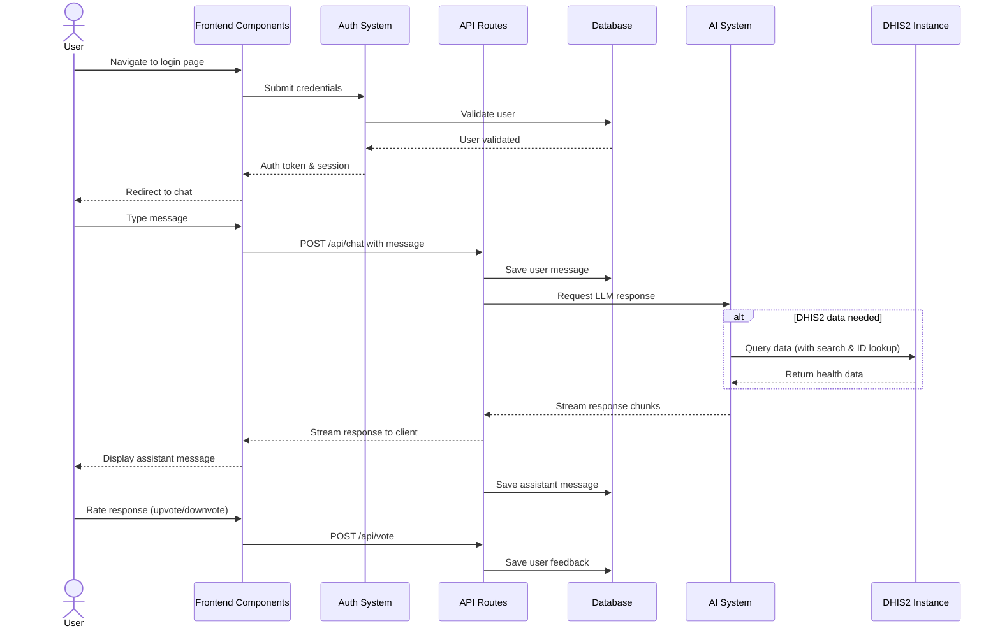

## 3. AI Model Integration with DHIS2

Sequence of how the front end calls the AI service, which queries DHIS2 and returns results.

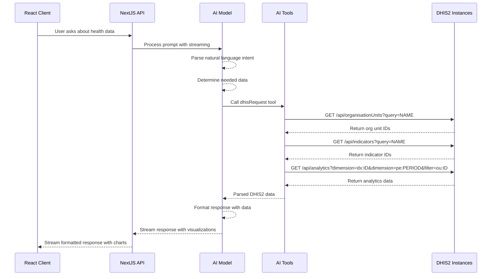

## 4. Core Application Architecture Overview

Class-style diagram of core classes/modules in the application.

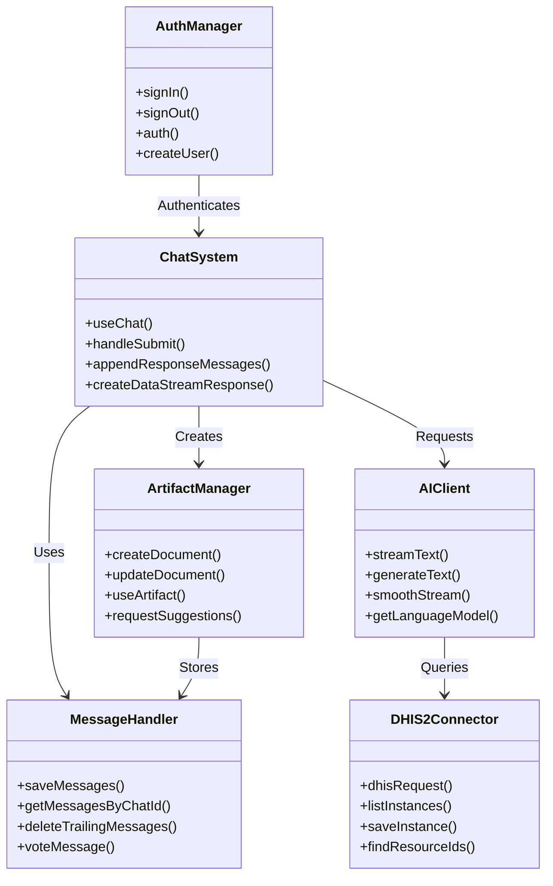

## 5. Component Hierarchy & Data Flow

Flowchart showing how data moves through React components.

```mermaid
flowchart TD
    subgraph "Layout Structure"
        L[app/layout.tsx]
        CL[chat/layout.tsx]
        CP[chat/page.tsx]
        CID[chat/[id]/page.tsx]
    end

    subgraph "Core Components"
        Chat[Chat Component]
        Messages[Messages]
        Artifact[Artifact]
        DSH[DataStreamHandler]
    end

    subgraph "Input & Output"
        MM[MultimodalInput]
        MSG[Message]
        MA[MessageActions]
        PA[PreviewAttachment]
        ME[MessageEditor]
    end

    subgraph "UI Components"
        CH[ChatHeader]
        ST[SidebarToggle]
        MS[ModelSelector]
        VS[VisibilitySelector]
        SA[SuggestedActions]
        MI[MarkdownInterface]
    end

    subgraph "Data Flow"
        useChat[useChat Hook]
        useArtifact[useArtifact Hook]
        API[API Routes]
        DB[(Database)]
    end

    L --> CL
    CL --> CP
    CL --> CID
    CP --> Chat
    CID --> Chat

    Chat --> Messages
    Chat --> Artifact
    Chat --> DSH
    Chat --> MM
    Chat --> CH

    Messages --> MSG
    MSG --> MA
    MSG --> ME

    MM --> PA
    MM --> SA

    CH --> ST
    CH --> MS
    CH --> VS

    Chat --> useChat
    Artifact --> useArtifact
    useChat --> API
    useArtifact --> API
    API --> DB

    DSH --> useChat
    DSH --> useArtifact
```

## 6. Frontend Module Structure

Diagram of pages, layouts, and hooks organization.

```mermaid
flowchart TB
    subgraph "App Directory Structure"
        app[app]
        app_auth[app/(auth)]
        app_chat[app/(chat)]
    end

    subgraph "Auth Pages"
        login[login/page.tsx]
        register[register/page.tsx]
        auth_ts[auth.ts]
        auth_config[auth.config.ts]
        actions[actions.ts]
    end

    subgraph "Chat Pages"
        chat_page[page.tsx]
        chat_id[chat/[id]/page.tsx]
        settings[settings/page.tsx]
        chat_actions[actions.ts]
    end

    subgraph "API Routes"
        api_chat[api/chat/route.ts]
        api_doc[api/document/route.ts]
        api_vote[api/vote/route.ts]
        api_hist[api/history/route.ts]
        api_sugg[api/suggestions/route.ts]
    end

    subgraph "React Hooks"
        useChat[useChat]
        useArtifact[use-artifact.ts]
        useChatVis[use-chat-visibility.ts]
        useMobile[use-mobile.tsx]
        useScrollBot[use-scroll-to-bottom.ts]
    end

    app --> app_auth
    app --> app_chat

    app_auth --> login
    app_auth --> register
    app_auth --> auth_ts
    app_auth --> auth_config
    app_auth --> actions

    app_chat --> chat_page
    app_chat --> chat_id
    app_chat --> settings
    app_chat --> chat_actions
    app_chat --> api_chat
    app_chat --> api_doc
    app_chat --> api_vote
    app_chat --> api_hist
    app_chat --> api_sugg

    chat_page -.-> useChat
    chat_id -.-> useChat
    chat_id -.-> useArtifact

    useChat -.-> useChatVis
    useChat -.-> useScrollBot
    useArtifact -.-> useMobile
```

## 7. Chat System & API Sequence

Sequence diagram of a chat message from client → Next.js API → AI service → response.

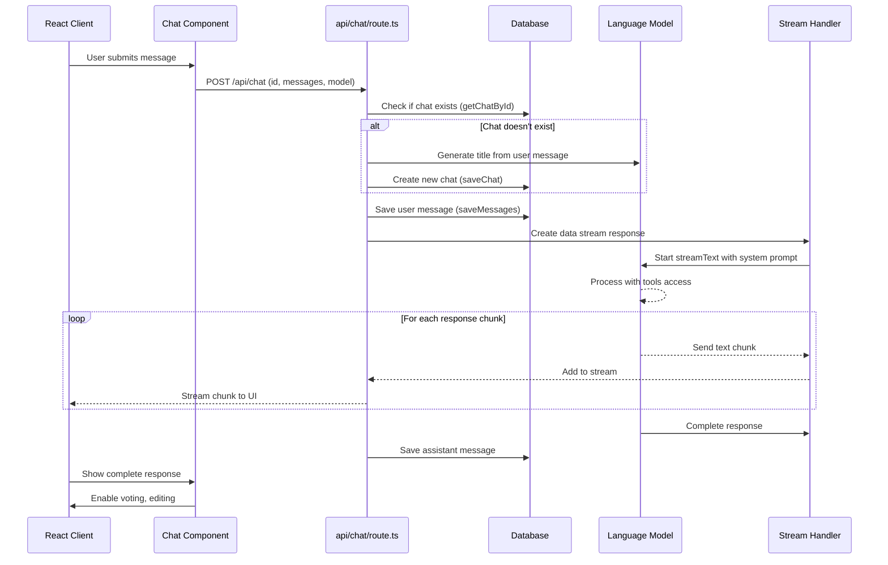

## 8. Database Schema (ER Diagram)

Entities and relationships as a Mermaid entity-relationship diagram.

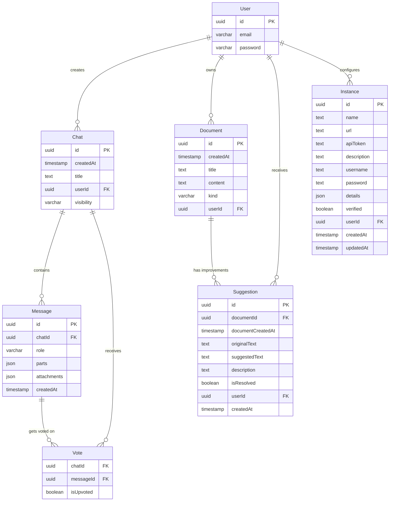

## 9. DHIS2 Integration Flow

Flow of data between the backend and DHIS2 instance.

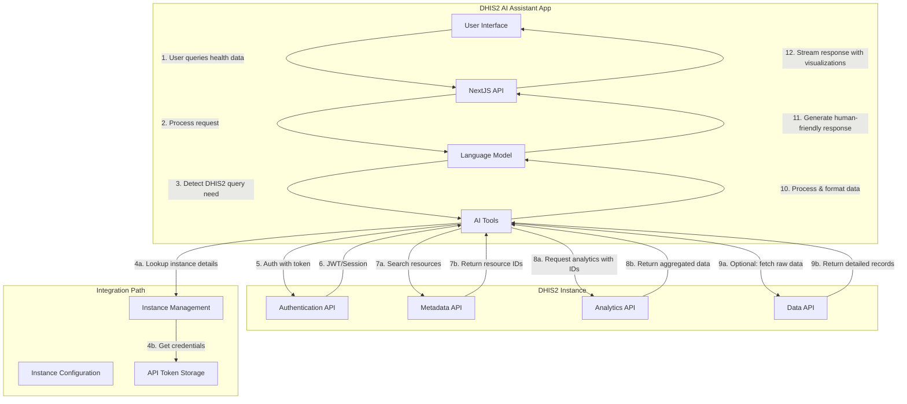

## 10. Authentication System Sequence

Sequence of login or registration flow.

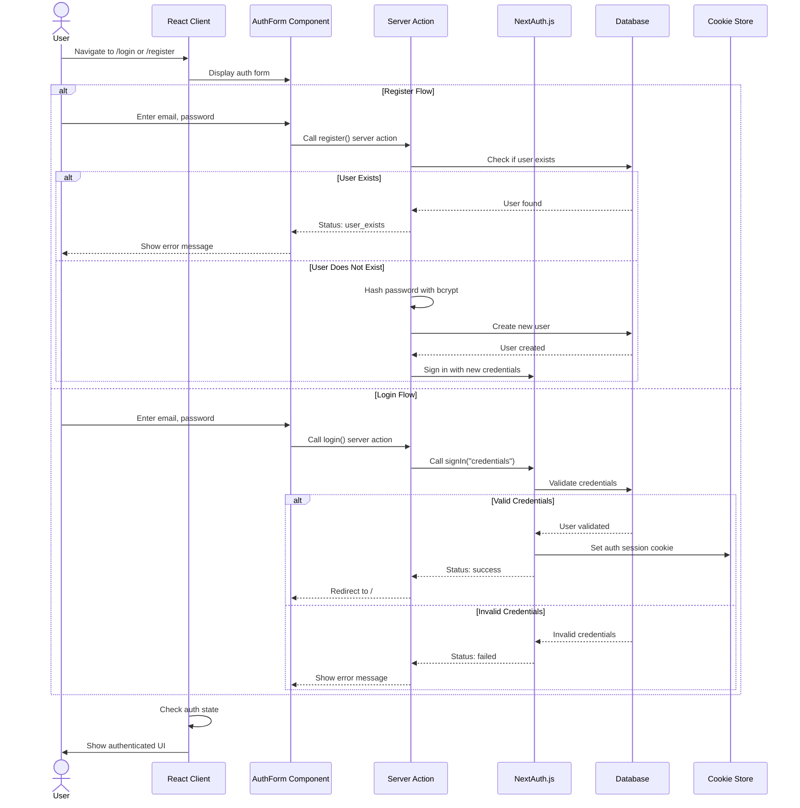

## 11. Deployment & Infrastructure

Diagram of hosting, CI/CD, and environment configuration.

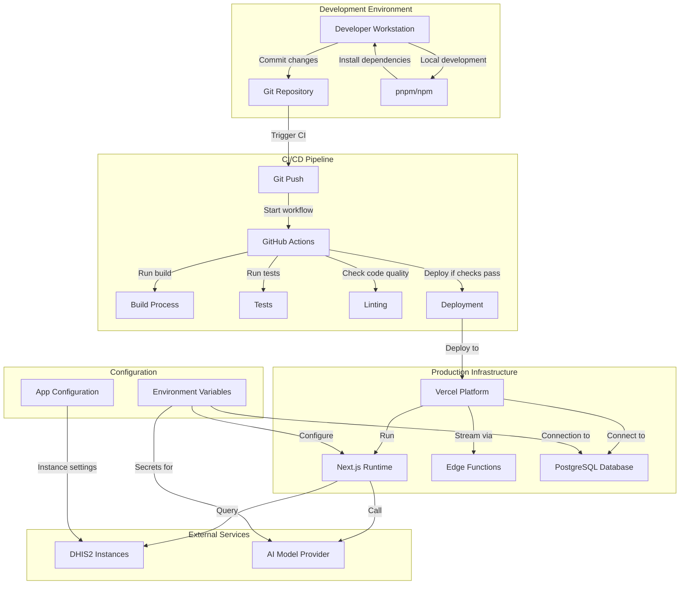

## 12. Message Processing Pipeline

Sequence showing how an incoming message is parsed, streamed, and rendered.

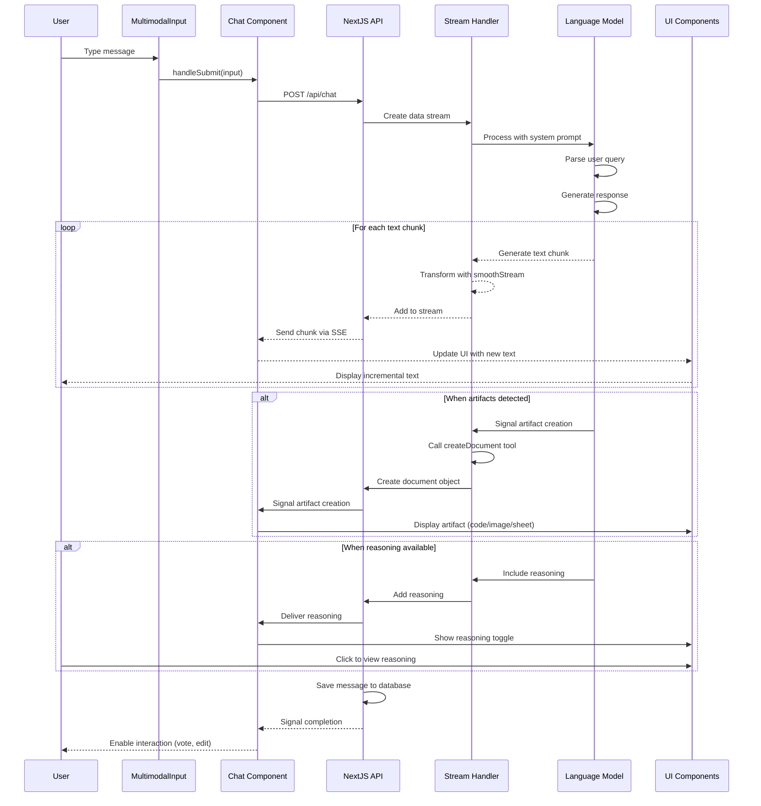

## 13. API Client-Side Components Data Flow

Flow of data from hooks → API calls → components.

```mermaid
flowchart LR
    subgraph "React Hooks"
        useChat[useChat]
        useArtifact[useArtifact]
        useChatVis[useChatVisibility]
        useSWR[useSWR]
    end

    subgraph "API Client Functions"
        fetcher[fetcher]
        POST[POST requests]
        GET[GET requests]
        PATCH[PATCH requests]
        DELETE[DELETE requests]
    end

    subgraph "API Routes"
        chat[/api/chat]
        document[/api/document]
        vote[/api/vote]
        history[/api/history]
        suggestion[/api/suggestions]
    end

    subgraph "UI Components"
        Chat[Chat]
        Messages[Messages]
        Message[Message]
        Artifact[Artifact]
        SidebarHistory[SidebarHistory]
        Actions[MessageActions]
    end

    useChat --> POST
    useChat --> Chat
    useChat --> Messages

    useArtifact --> POST
    useArtifact --> GET
    useArtifact --> Artifact

    useChatVis --> PATCH
    useChatVis --> Chat

    useSWR --> fetcher
    useSWR --> GET
    useSWR --> SidebarHistory
    useSWR --> Actions

    POST --> chat
    POST --> document
    PATCH --> vote
    GET --> history
    GET --> document
    GET --> vote
    GET --> suggestion
    DELETE --> chat
    DELETE --> document

    chat --> Chat
    document --> Artifact
    vote --> Actions
    history --> SidebarHistory
    suggestion --> Artifact

    Chat --> Message
    Messages --> Message
```

## 14. Model Inference Process

Diagram of how requests are batched, sent to the AI model, and streamed back.

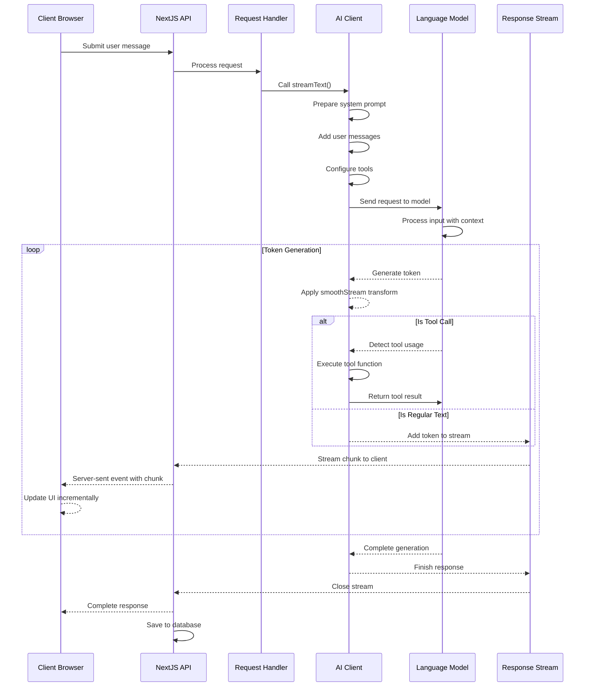

## 15. Data Storage & Retrieval Flow

End-to-end flow of saving a new artifact or message to the database and fetching it.

```mermaid
flowchart TD
    subgraph "User Interaction"
        UserMsg[User sends message]
        AIResp[AI responds]
        UserArt[User creates artifact]
    end

    subgraph "Frontend Components"
        Chat[Chat component]
        Artifact[Artifact component]
        DSH[DataStreamHandler]
    end

    subgraph "Hooks & State"
        useChat[useChat hook]
        useArtifact[useArtifact hook]
        ChatState[Chat state]
        ArtState[Artifact state]
    end

    subgraph "API Layer"
        ChatAPI[/api/chat]
        DocAPI[/api/document]
        HistAPI[/api/history]
    end

    subgraph "Server Logic"
        SaveMsg[saveMessages]
        SaveDoc[saveDocument]
        GetMsg[getMessagesByChatId]
        GetDoc[getDocumentsById]
    end

    subgraph "Database"
        MsgDB[(Message Table)]
        DocDB[(Document Table)]
        ChatDB[(Chat Table)]
    end

    %% Creation flow
    UserMsg --> Chat
    Chat --> useChat
    useChat --> ChatAPI
    ChatAPI --> SaveMsg
    SaveMsg --> MsgDB

    AIResp --> DSH
    DSH --> useArtifact
    useArtifact --> DocAPI
    DocAPI --> SaveDoc
    SaveDoc --> DocDB

    UserArt --> Artifact
    Artifact --> useArtifact

    %% Retrieval flow
    Chat --> HistAPI
    HistAPI --> ChatDB
    ChatDB --> ChatState

    ChatState --> useChat
    useChat --> GetMsg
    GetMsg --> MsgDB
    MsgDB --> Chat

    ArtState --> useArtifact
    useArtifact --> GetDoc
    GetDoc --> DocDB
    DocDB --> Artifact
```
